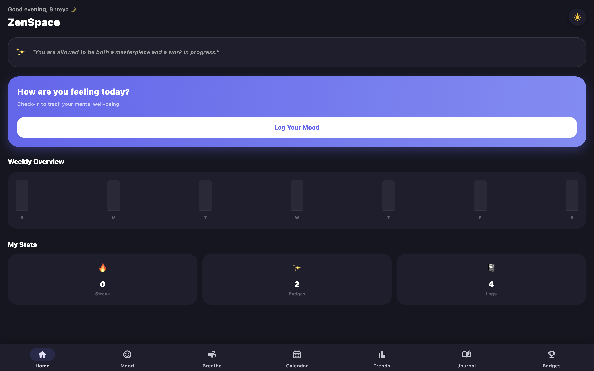
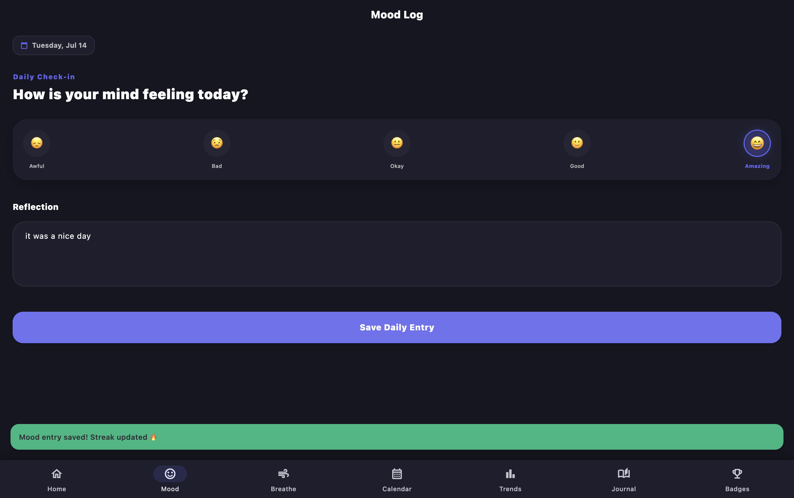
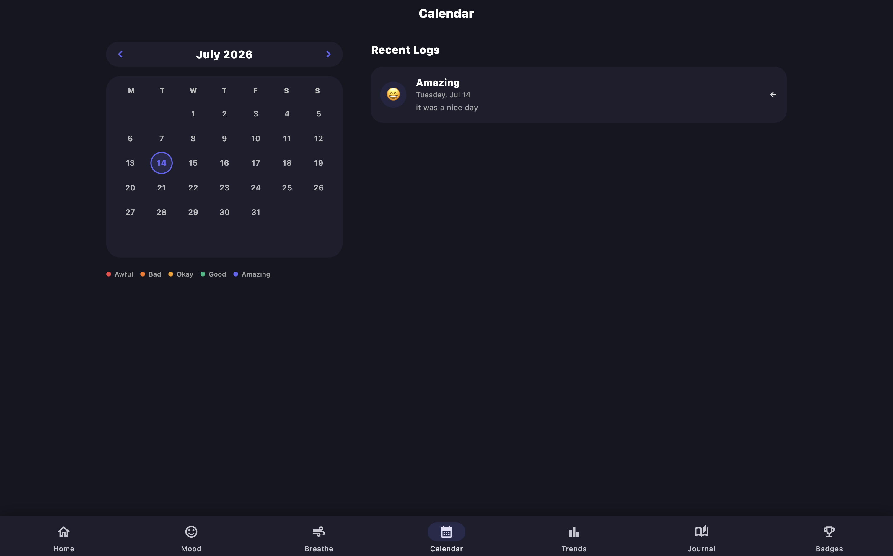
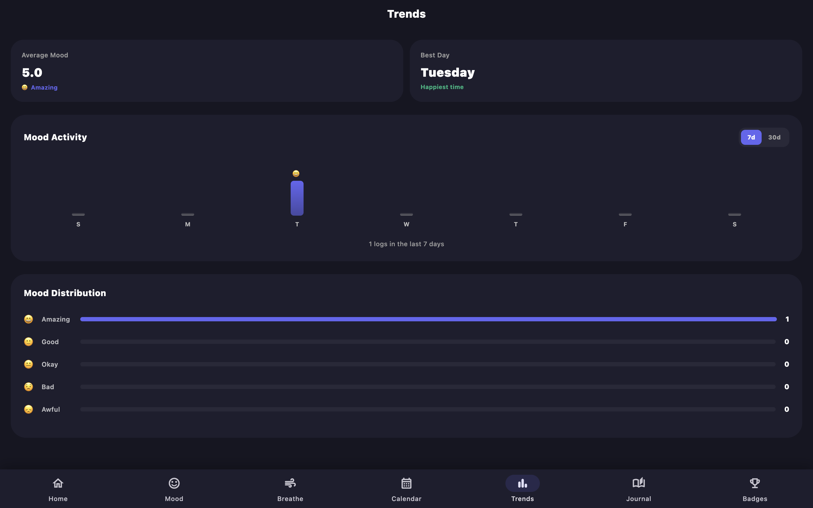
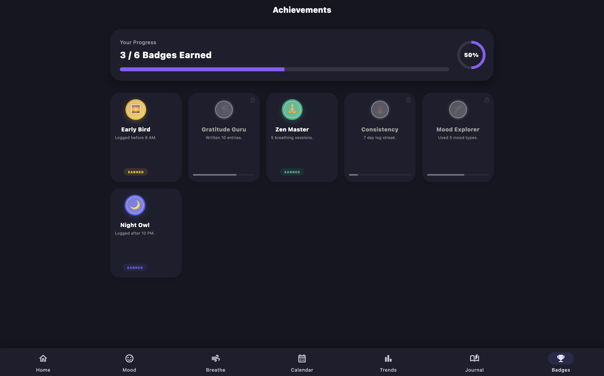
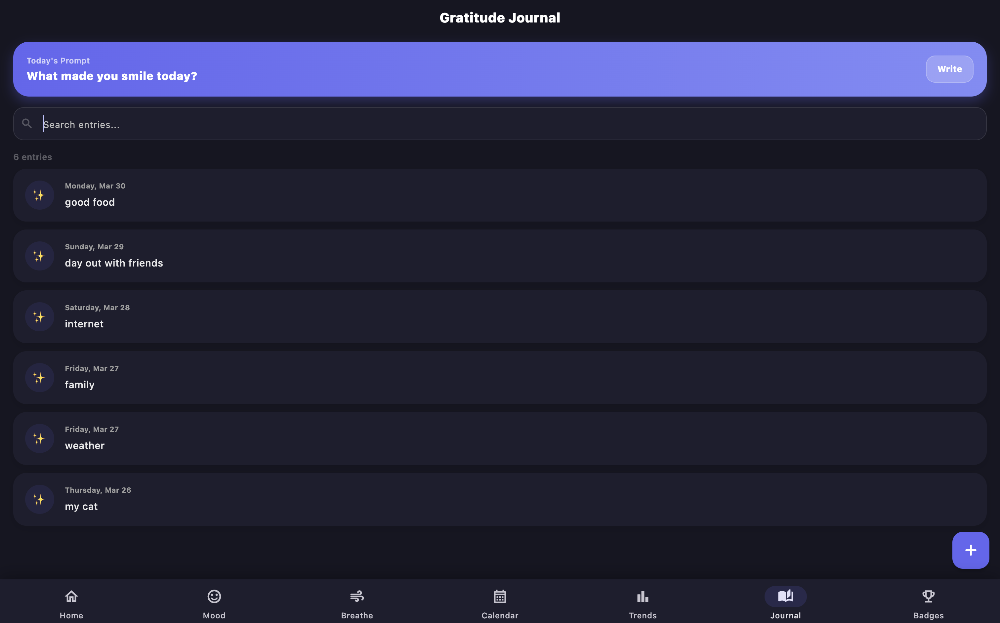
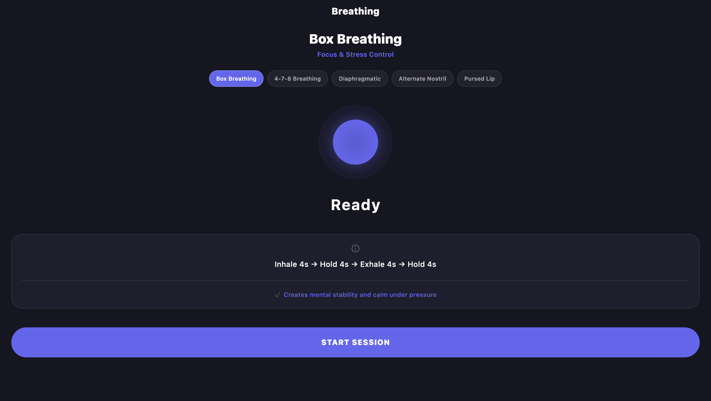
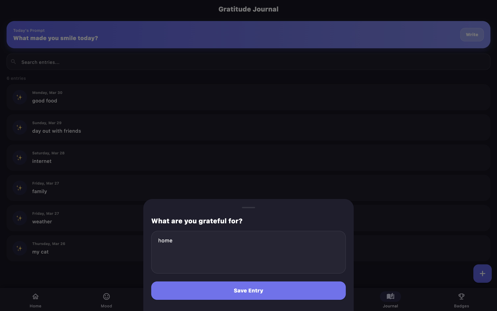
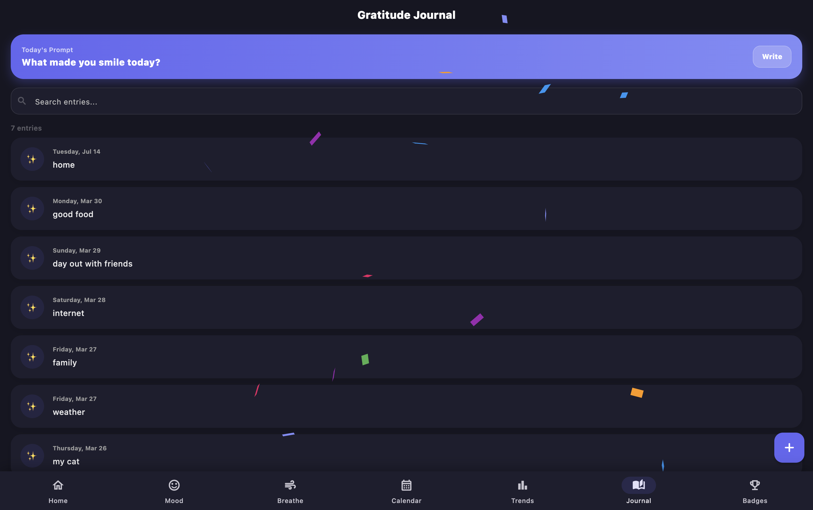

# 🧘 ZenSpace

ZenSpace is a premium, cross-platform mental wellness application built with Flutter. It provides a personal sanctuary for users to track their emotional well-being, practice mindfulness, and reflect on their journey—all while keeping data private and local.

## 📸 Screenshots

### Dashboard & Tracking

| Home Screen | Mood Logger | Visual Calendar |
| :---: | :---: | :---: |
|  |  |  |

### Analytics & Progress

| Trends Analytics | Achievements | Gratitude Journal |
| :---: | :---: | :---: |
|  |  |  |

### Mindfulness & Rewards

| Breathing Exercise | Daily Prompt | Confetti Reward |
| :---: | :---: | :---: |
|  |  |  |

## ✨ Features

- **📊 Mood Tracking:** Log your daily emotions on a 5-point scale with optional reflections.
- **📈 Insightful Trends:** Visualize your emotional journey with weekly overview charts and mood distribution analytics.
- **📅 Visual Calendar:** A color-coded calendar view to see your historical mood patterns at a glance.
- **🫁 Guided Breathing:** Five scientifically-backed breathing techniques (Box, 4-7-8, etc.) with high-quality synchronized animations.
- **📓 Gratitude Journal:** Maintain a daily journal of positive moments with real-time search and delightful confetti rewards.
- **🏆 Achievements:** A gamified experience with dynamic badges that unlock based on your actual wellness habits.
- **🌓 Dark Mode:** Full system-wide support for Light and Dark modes with a sophisticated Midnight palette.
- **🔒 Privacy First:** All data is stored locally on-device using SQLite; no cloud syncing of your sensitive personal data.

## 🚀 Tech Stack

- **Framework:** [Flutter](https://flutter.dev/) (Dart)
- **Database:** [SQLite](https://pub.dev/packages/sqflite) (`sqflite`) for persistent storage.
- **Local Storage:** `SharedPreferences` for user preferences and streak tracking.
- **Animations:** Custom `AnimationController` logic & [Confetti](https://pub.dev/packages/confetti).
- **Architecture:** Modular and responsive design supporting Mobile and Desktop.

## 🏗️ Architecture Note

ZenSpace follows a modular design pattern:
- **UI Layer (`lib/screens/`):** Separated into specialized screens for each feature, utilizing responsive layouts for mobile and desktop.
- **Data Layer (`lib/database_helper.dart`):** A singleton manager handling SQLite operations, schema definitions, and migrations.
- **Business Logic (`lib/streak_helper.dart`):** Decoupled logic for calculating user activity streaks.
- **State Management:** Uses `ValueNotifier` for global theme and UI refresh propagation, ensuring a reactive user experience.

## 🛠️ Installation & Setup

1. **Clone the repository:**
   ```bash
   git clone https://github.com/Shreyaroshan/ZenSpace.git
   cd ZenSpace
   ```

2. **Install dependencies:**
   ```bash
   flutter pub get
   ```

3. **Run the application:**
   ```bash
   flutter run
   ```

## 🧪 Testing

The project includes unit tests for core database and streak logic. Run them using:
```bash
flutter test
```

---
Developed with ❤️ by Shreyaroshan
